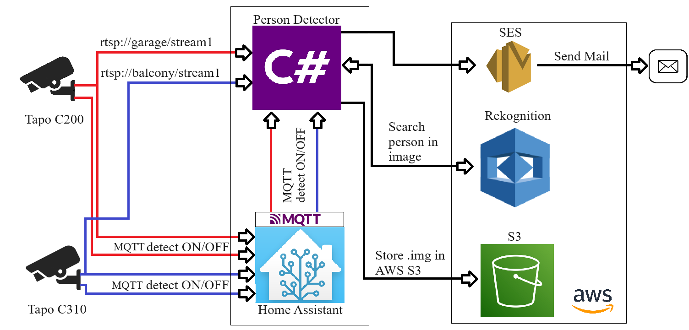

# PersonDetector

A C# .NET 6.0 console application for **automated person detection from IP cameras**. The system monitors multiple RTSP video streams, and when an external system (Home Assistant) detects motion via a PIR sensor, the application starts capturing frames, analyzes them using AI, and if a person is found, stores evidence in the cloud and sends an email notification.

---

## 1. Project Identity

| Attribute | Value |
|-----------|-------|
| Name | `PersonDetector` |
| Type | Console Application (Exe) |
| Framework | .NET 6.0 |
| Language | C# with `ImplicitUsings` and `Nullable` enabled |
| Paradigm | Asynchronous, multi-threaded, event-driven |

---

## 2. System Purpose

The system is an **automated IP camera surveillance solution**. It watches multiple RTSP video streams and upon receiving a motion trigger from Home Assistant (via MQTT), starts capturing frames, analyzes them with AWS Rekognition AI, and alerts the user if a person is detected.

---

## 3. Architecture



The application integrates:
- **Tapo IP cameras** (C200, C310) providing RTSP video streams
- **Home Assistant** as the motion detection trigger via MQTT
- **AWS Rekognition** for AI-based person detection
- **AWS S3** for storing detected frames
- **AWS SES** for email notifications

---

## 4. Class Descriptions

### 4.1 `Program.cs` — Entry Point

Application lifecycle:
1. Creates `Logger`
2. Creates `Detector` and calls `Settings()` (async initialization)
3. Waits for a keypress (`Console.ReadKey`)
4. Logs shutdown and calls `detector.Stop()`

---

### 4.2 `Settings.cs` — Configuration Model

A POCO object deserialized from `settings.json`:

| Property | Type | Description |
|----------|------|-------------|
| `mqttServer` | `string` | MQTT broker IP address |
| `mqttPort` | `int` | MQTT broker port (default: 1883) |
| `mqttCredentialsName` | `string` | MQTT username |
| `mqttCredentialsPassword` | `string` | MQTT password |
| `bufferLimit` | `int` | Max frames stored per motion event |
| `S3Bucket` | `string` | AWS S3 bucket name |
| `streams` | `Dictionary<string,string>` | Map: MQTT topic → RTSP URL |

Configuration is loaded from `settings.template.json` — copy it to `settings.json` and fill in your values:


---

### 4.3 `Frame.cs` — Frame Data Model

```csharp
string date   // timestamp + camera name: "camera_yyyy-MM-dd_HH:mm:ss"
Mat    frame  // OpenCV Mat object (uncompressed image data in memory)
```

---

### 4.4 `Logger.cs` — Logging System

- Dual output: colored console + `log.txt` file
- Thread-safe via `lock(_lock)`
- Auto-creates `log.txt` if it doesn't exist
- Log format: `yyyy:MM:dd HH:mm:ss [component_name] message`

**Color coding:**

| Color | Meaning |
|-------|---------|
| 🟢 Green | Success (connection, detection) |
| 🔴 Red | Error, shutdown |
| 🔵 Blue | Info (new capture object) |
| ⚪ Gray | Standard message |


The annotated console output shows the startup sequence:
1. Start Application
2. Connect to MQTT Broker
3. Subscribe to MQTT Topics
4. Create Streams
5. Create Streams internal Tasks
6. Wait for RTSP → **Person detected**

---

### 4.5 `Detector.cs` — Main Orchestrator

#### Constructor
- Reads `settings.json` (path resolved 3 levels up from `bin/Debug/net6.0/`)
- Deserializes JSON into `Settings` using `System.Text.Json`
- Creates MQTT client via `MqttFactory`

#### `Settings()` — Async Initialization
1. Validates MQTT configuration
2. Registers event handlers (`Connected`, `Disconnected`, `MessageReceived`)
3. Connects to MQTT broker
4. Subscribes to a topic for each configured stream (QoS 0)
5. Creates and starts all `StreamCapture` instances

#### MQTT Message Handler

When a motion event arrives from Home Assistant:


```
payload == "on"  → readingStart() on the matching stream
payload != "on"  → readingStop()  on the matching stream
```

---

### 4.6 `StreamCapture.cs` — Core of the System

The most complex class. Manages the full lifecycle of a single camera.

#### State Variables

| Variable | Type | Protection | Description |
|----------|------|------------|-------------|
| `running` | `bool` | *(none)* | Controls the main loop of both threads |
| `reading` | `bool` | `_readingLock` | Whether frames should be captured |
| `buffer` | `List<List<Frame>>` | `_lock` | Shared buffer between threads |
| `tasks` | `List<Task>` | *(none)* | 2 threads: FrameCatch + ProcessBufferItem |

#### Thread 1: `FrameCatch()`

Continuously reads frames from the RTSP stream into an internal buffer. On stream failure, the `VideoCapture` object is disposed and recreated — providing automatic camera reconnect.

**Balcony camera stream:**


**Garage camera stream:**


#### Thread 2: `ProcessBufferItem()`

Processes captured frame buffers:

```
1. Take first item from buffer (thread-safe)
2. Check frames at index 1, 2, 3 and middle index
3. For each: ConvertMatToByteArray → DetectPersonInImage (AWS Rekognition)
4. Keep the frame with highest confidence
5. If person detected (confidence ≥ 75%):
   - StoreToS3Bucket()
   - SendEmailWithAttachment()
6. Dispose all frames
7. Sleep(100ms) to release CPU
```

#### `DetectPersonInImage()` — AWS Rekognition

```
Input:  byte[] (JPEG frame)
Output: float (confidence 0–100, or 0 if no person found)

Request parameters:
  MaxLabels:     10
  MinConfidence: 75%

Logic:
  Iterates all detected labels
  Finds label "person" with confidence >= 75
  Returns the highest confidence value
```

#### `StoreToS3Bucket()` — AWS S3

Object key format: `{camera_name}/{timestamp}_{confidence}_{index}`

Example: `balcony_cameraMotion/2024-06-13_10:41:32_95,40874_1`

**Balcony camera — S3 bucket (309 objects):**


**Garage camera — S3 bucket (259 objects):**


#### `SendEmailWithAttachment()` — AWS SES

Email content:
- **Subject:** camera name
- **Body:** camera name + S3 key + timestamp
- **Attachment:** JPEG frame as `person.jpg`

**Email notification from balcony camera:**


**Email notification from garage camera:**


---

## 5. Full Data Flow

```
PIR Sensor
    │
    ▼
Home Assistant
    │  MQTT topic: "camera/motionDetector"
    │  Payload: "on" / "off"
    ▼
Detector.HandleReceivedMessageAsync()
    │
    ├─► "on"  → StreamCapture.readingStart()
    │              │
    │              ▼
    │          FrameCatch() fills the buffer
    │
    └─► "off" → StreamCapture.readingStop()
                   │
                   ▼
               internalList → buffer (transfer)
                   │
                   ▼
               ProcessBufferItem() picks up the buffer
                   │
                   ▼
               Select frames [1, 2, 3, middle]
                   │
                   ▼
               AWS Rekognition (DetectLabels)
                   │
                   ├── confidence < 75% → skip
                   │
                   └── confidence ≥ 75% → person detected!
                           │
                           ├─► AWS S3: store best frame
                           └─► AWS SES: send email with image
```

---

## 6. Dependencies (NuGet Packages)

| Package | Version | Purpose |
|---------|---------|---------|
| `AWSSDK.Rekognition` | 3.7.302.25 | AI object/person detection |
| `AWSSDK.S3` | 3.7.308.7 | Cloud storage for frames |
| `AWSSDK.SimpleEmail` | 3.7.300.100 | Email notifications |
| `Emgu.CV` | 4.9.0.5494 | OpenCV wrapper — video reading |
| `Emgu.CV.runtime.windows` | 4.9.0.5494 | Native OpenCV binaries for Windows |
| `MimeKit` | 4.6.0 | MIME email construction with attachment |
| `MQTTnet` | 4.3.6.1152 | MQTT client for Home Assistant integration |
| `OpenCvSharp4` | 4.9.0.20240103 | Alternative OpenCV wrapper |
| `OpenCvSharp4.runtime.win` | 4.9.0.20240103 | Native binaries for OpenCvSharp |

---

## 7. Setup

1. Clone the repository
2. Copy `settings.template.json` to `settings.json`
3. Fill in your values:
   - MQTT broker address and credentials
   - AWS S3 bucket name
   - RTSP stream URLs for each camera
4. Configure AWS credentials (via `~/.aws/credentials` or environment variables)
5. Build and run:
```bash
dotnet build
dotnet run
```

> ⚠️ `settings.json` is listed in `.gitignore` — never commit it with real credentials.

---

## 8. Known Issues & Improvement Suggestions

### 🔴 Critical

| # | Issue | Location | Description |
|---|-------|----------|-------------|
| 1 | `async void` | `StreamCapture.cs:172` | `ProcessBufferItem()` is `async void` — exceptions are swallowed silently |
| 2 | `ForEach` with async lambda | `Detector.cs:148` | `Stop()` uses `async` lambda in `ForEach` — not properly awaited |
| 3 | Missing MQTT reconnect | `Detector.cs:197` | After MQTT broker disconnect the app never reconnects — logic is commented out |

### 🟡 Medium

| # | Issue | Location | Description |
|---|-------|----------|-------------|
| 4 | New AWS client per call | `StreamCapture.cs:335` | `AmazonRekognitionClient` and `AmazonS3Client` recreated on every frame |
| 5 | Validation bug (`&&` vs `\|\|`) | `Detector.cs:65` | Only fails if ALL MQTT params are empty simultaneously |
| 6 | Index 0 never checked | `StreamCapture.cs:202` | First frame in buffer is never sent for analysis |
| 7 | Potential index out of range | `StreamCapture.cs:202` | Buffer with fewer than 4 frames may throw `ArgumentOutOfRangeException` |
| 8 | `Frame` missing `IDisposable` | `Frame.cs` | `Mat` is an unmanaged resource — class should implement `IDisposable` |
| 9 | Hardcoded SES region | `StreamCapture.cs:251` | `EUCentral1` is hardcoded, should be in configuration |

### 🟢 Minor / Suggestions

| # | Suggestion | Description |
|---|-----------|-------------|
| 10 | Windows Service | App runs until keypress — a `BackgroundService` would be more suitable for production |
| 11 | `settings.json` path | `../../../settings.json` only works for Debug builds |
| 12 | Email addresses hardcoded | From/To addresses are hardcoded in `StreamCapture.cs` — should be in `settings.json` |
